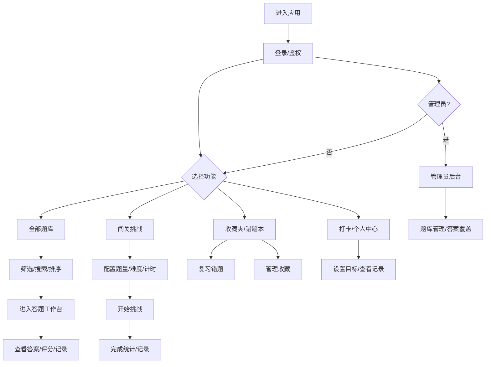
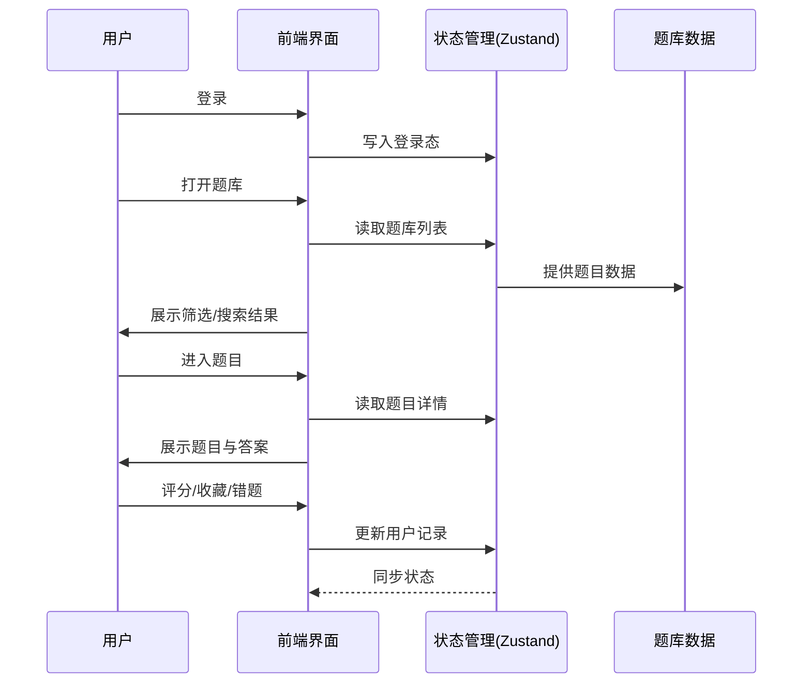

# Unity 面试宝典 · Interview App

一个基于 React + TypeScript + Vite 的面试刷题与题库管理应用。内置高频 Unity 面试题、闯关挑战、错题本、收藏、打卡等功能，并支持管理员覆盖题库与答案。

## 功能概览
- **题库浏览**：按题号排序、标签筛选、关键词搜索，支持快速定位题目。
- **答题工作台**：题目与答案同屏呈现，支持输入个人解答与评分。
- **闯关挑战**：可配置题量与难度，计时答题与完成统计。
- **收藏与错题**：一键收藏、错题记录与复习回顾。
- **练习数据**：刷题次数、完成记录、评分星级可追踪。
- **打卡与目标**：每日打卡与学习目标管理。
- **管理员能力**：题库管理、答案覆盖、内容维护。

[在线访问](https://futuredo.github.io/interview-app/) · [部署指南](DEPLOYMENT.md) · [公益说明](README.md#项目初衷与公益性我的视角)


## 环境要求
- Node.js 18+（推荐 20+）
- pnpm / npm / yarn 任选其一

## 本地运行
```bash
npm install
npm run dev
```

## 构建与预览
```bash
npm run build
npm run preview
```

## 常用脚本
- `npm run dev`：本地开发
- `npm run build`：生产构建
- `npm run preview`：本地预览构建产物
- `npm run lint`：代码检查

## 项目初衷与公益性（我的视角）
我做这个 Unity 面试宝典的初衷，是想把自己整理过的高频面试题、复习路径与答题思路，做成一个任何人都能直接使用的开源练习平台。比起堆资料，我更希望把“如何高效备考”这件事做成一套可持续复用的工具。

### 公益性说明
- **免费开放**：项目完全免费使用，不设置付费墙，也不做商业化内容分发。
- **降低信息差**：把零散资料结构化，帮助更多人用更少的时间掌握关键知识。
- **鼓励共创**：题库与答案支持持续补充与完善，欢迎社区一起改进与校对。
- **可复用与可扩展**：通过开源与模块化设计，让学习工具可以被更多人复用、二次开发。

### 我希望它带来的价值
- 让入门者有清晰的学习路线与可执行的练习节奏
- 让正在备考的同学减少“找资料”的时间成本
- 让每一次刷题都能留下可追踪的成长记录

## 功能流程图


## 交互流程图


## 部署说明
请查看 `DEPLOYMENT.md`。

---

